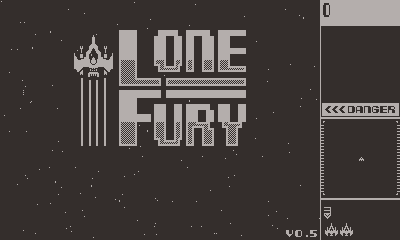

# Intro

This is my first serious attempt at a complete Lua game for the [Play.Date](https://play.date/) using the [PlayDate Lua SDK](https://sdk.play.date/2.6.2/Inside%20Playdate.html). It's light clone of the Namco 1981 classic coin-op [arcade game Bosconian](https://en.wikipedia.org/wiki/Bosconian).

Here's the [itch.io page](https://cranehed.itch.io/lone-fury-arcade-shooter-playdate). Distributed under the [MIT License](./LICENSE).

# Repo Structure

The repo is pretty raw and wriggling, there's experimental code floating around - like most code-bases. I've made a minimal effort to tidy things up before making it public.

- /source - is all the .lua files.
- /source/assets - is the .wav files.
- /source/images - is mainly my work, derived from Bosconian screen grabs largely.
- /source/SystemAssets - is the suggested Play.Date title cards etc.
- /tools - is a largely abandoned attempt at a way to build JSON level definitions from PNG images. Also used for enemy formations.

## Game State Engine

I like the [State pattern](https://en.wikipedia.org/wiki/State_pattern), so it's used to manage game state. It's not a full State pattern implementation (because the game Context is a bunch of globals you'll find in [main.lua](./source/main.lua)). State like this is useful because it saves you from having a wall of ``if then else end`` in your main game loop - which is both inefficient and painful to maintain. It's also very easy to drop in new states, or change the order of states as you work.

If you look at [main.lua](./source/main.lua) you'll see it simply calls the current state's update method for the current state, and the current state can either return itself, or a new state.

Here's a mermaid diagram of the states used. You'll need a [plug-in to view this in VSCode](https://marketplace.visualstudio.com/items?itemName=bierner.markdown-mermaid).

::: mermaid
stateDiagram
    [*] --> StateMenu
    StateMenu --> StateInstructions : Timer
    StateInstructions --> StateHighScore : Timer
    StateHighScore --> StateMenu : Timer
    StateMenu --> StateStart : Button press
    StateInstructions --> StateStart : Button press
    StateHighScore --> StateStart : Button press
    StateStart --> StateRespawn
    StateRespawn --> StateGame : 3,2,1 Timer
    StateGame --> StateNewLevel : All bases destroyed
    StateGame --> StateDead : Player dies
    StateNewLevel --> StateRespawn
    StateDead --> StateGameOver : Player has no ships
    StateGameOver --> StateHighScoreEntry : Player has high score
    StateHighScoreEntry --> StateMenu
    StateGameOver --> StateHighScore : Player score too low
    StateDead --> StateRespawn : Player ships remain
:::

## WorldView vs Viewport

The Lone Fury world is 2880 x 2880 pixels in size, while the game on screen is 320 x 240 pixels. The logical viewport chases the Player's World position, so the Player is always centre screen.

If a sprite is alive in the game, it's in the SDK sprite list. If it's near enough to the Player it is set visible so it draws, and may react to the Player by firing weapons etc. See [utility.lua](./source/utility.lua) for NearViewport() which is called every sprite:update().

### Cheating Enemies

The individual enemy flyers and the enemy formations cheat a little by **ignoring collisions** unless they are visible in the Viewport. This is because if the enemy flyers collided with asteroids and bases off-screen, they'd likely never reach the Player intact.

## All The Things in Pools

Garbage collection in Lua can be expensive and it's also unpredictable. Object creation is also kind of expensive, so why do it more than once! Lone Fury uses a couple of forms of pooling for assets and the game objects. This is so objects aren't created and destroyed while the game is running, but only on startup.

### Asset Pooling

The [assets.lua](./source/assets.lua) file pools game assets (bitmaps, bitmap tables, fonts, sounds), and is a direct implementation of this [Play.Date dev forum post](https://devforum.play.date/t/best-practices-for-managing-lots-of-assets/395).

### Object Pooling

Every object that's needed during a game is pre-created and stored in [poolManager.lua](./source/poolManager.lua). Every object in this pool will have a spawn and despawn function that's called as the objects are 'used' from the pool, or returned to it. Although in reality all that happens is that objects toggle their isSpawned flag and typically add() or remove() themselves from the Play.Date SDK sprite list.

Every object type that appears in this pool is also a Play.Date SDK sprite, because they're all involved in game rendering and collisions.

### Explosions

Explosions from [explosion.lua](./source/explosion.lua) also implements a small internal pool. Explosions are only drawn as bitmaps because they don't need to collide with things (the exception being [mineExplosion.lua](./source/mineExplosion.lua) which IS collidable).

# Credits

I've used various sound assets from [Kronbits](https://kronbits.itch.io/) and [Oryx Design Labs](https://oryxdesignlab.itch.io/) on [itch.io](https://itch.io)

The Xevious font comes from the [playdate-arcade-fonts](https://github.com/idleberg/playdate-arcade-fonts) repo which is derived from an [interesting book](https://readonlymemory.com/shop/book/arcade-game-typography/).

[Asperite](https://store.steampowered.com/app/431730/Aseprite/) for pixel art.
[Audacity](https://www.audacityteam.org/) for WAV crushing to mono to try and save space.